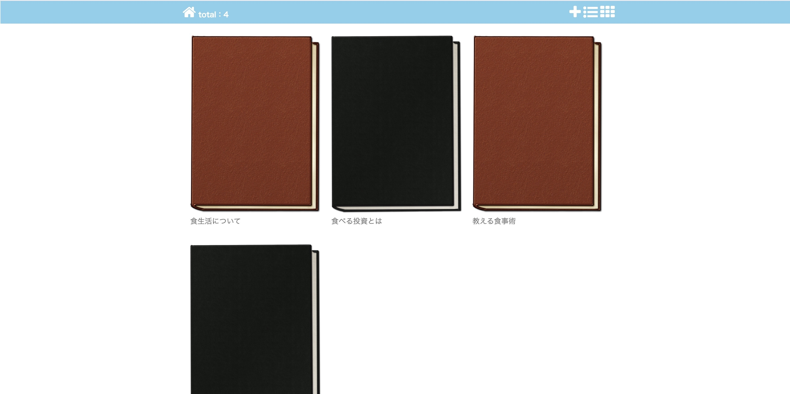
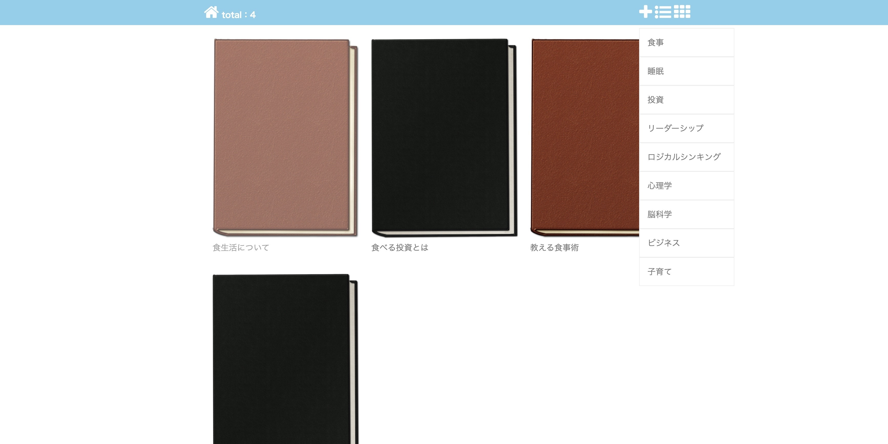
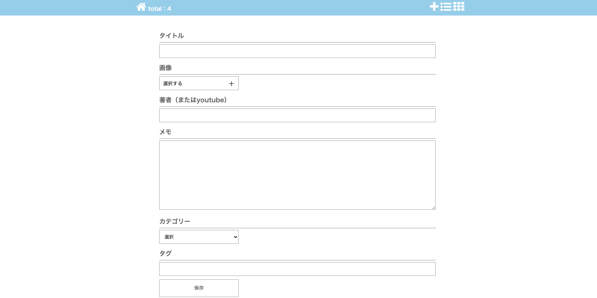
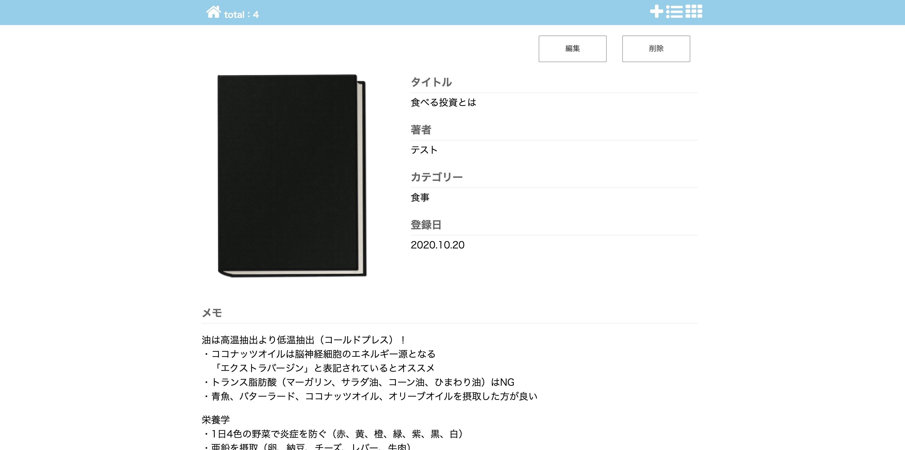

## アプリ名
bookmark  

## 概要
読んだ本の内容やそれから学んだことを、整理するためのアプリケーション。  
また、本のなかで調べた単語をまとめる単語帳も実施予定。

## 制作背景
本から得られた知識やなるほど！と思ったことをノートにまとめ、満足したら手放す我が家では、本の内容を見直したいけどどこに書いたか分からなくなっていたり、追記で見にくいノートが課題でした。  
また、SNSで発信ではなく気軽に家族内で共有できたらなと思い作成しました。  
出会った本を登録し、カテゴリーごとで検索することで同様な内容の本を振り返ることができます。  
本に関するメモなどをそれぞれで記録できるので、何がどれ、という時間を削減。 
今後は単語帳も実装する予定です。

## DEMO
  
### トップ

登録最新の6冊が表紙とタイトルで表示されます。左上の数字はどれだけ保存しているか表記しています。

### 検索

ヘッダーの右から２番目のアイコンでカテゴリーのリストが表示され、クリックすれば該当の本が表示されます。

### 登録

### 詳細

## 課題やこれから実装したいこと
・単語帳を作成し、登録・編集・削除・検索を実装  
・タグ付  
・本の並び順にも手が出るように学び続けたい  
・できるだけシンプルに使いやすいアプリにするための改善案を考え中

